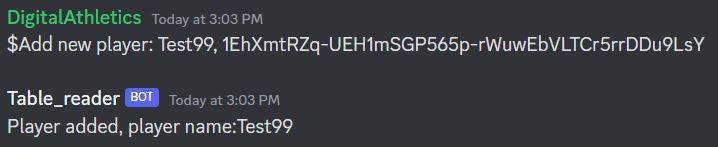
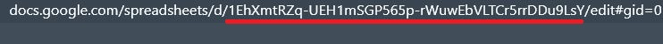
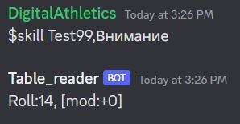

## About
This project was started at 2020, after the group i used to play board games (mainly Pathfinder, tabletop game where you use dices to understand the succesability of character actions) with was locked at homes due to epidemic.  
We megrated from offline meetings to Discord and our in-game character sheets move from paper to Google Sheets.  
Pretty fast i come to idea of simpification of the "i go to google sheet page, check my dice roll value, throw the dice and type result to chat" process.  
## How this works
This bot allows you to link your in-game character table (Generic table looks like [this](https://docs.google.com/spreadsheets/d/1EhXmtRZq-UEH1mSGP565p-rWuwEbVLTCr5rrDDu9LsY/edit#gid=0)) to bot using "Add new player command [ *character name*, *link to table*]"

In-game character name (should be unique, bot will say, if it is not) and
"link to the table" is unique part of Google Sheet link, looks like this

After that you can use various commands to get easy access to data stored in a table without looking into it each time

There is also few other commands. You can see full list by typing **$commands**.

It also makes playing from phone much more comfortable, allowing you to stay in Discord and not switching apps every time to check data in table.

## How to use  
You need to add bot token at the end of bot.py file and add bot to the Discord server.  
After that you need to run bot.py and it will do the magic.
